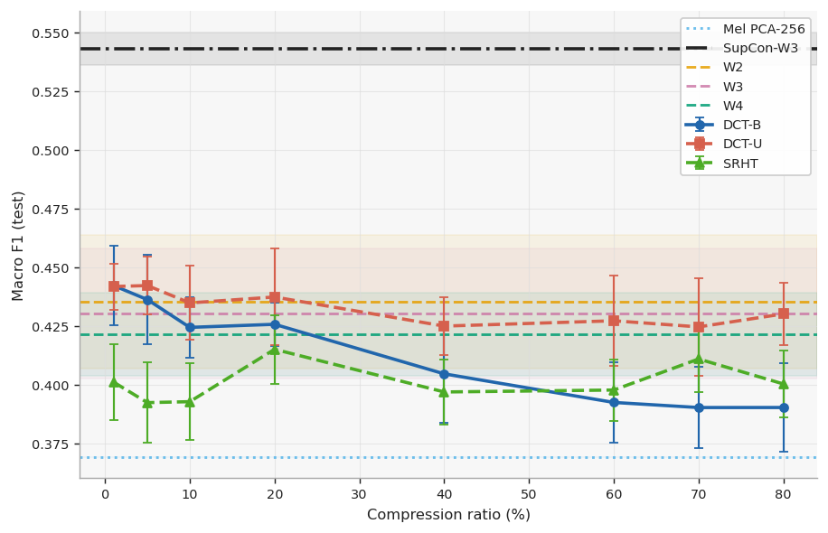
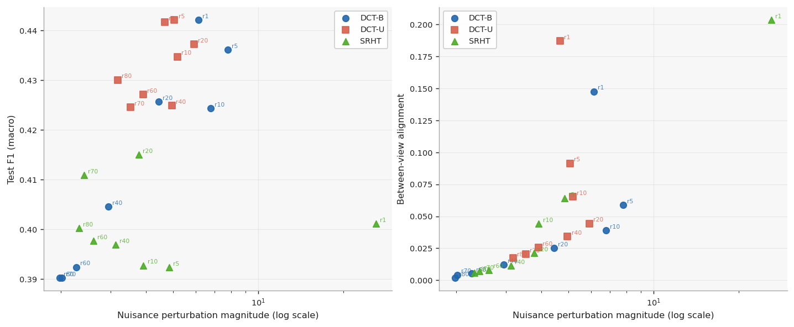
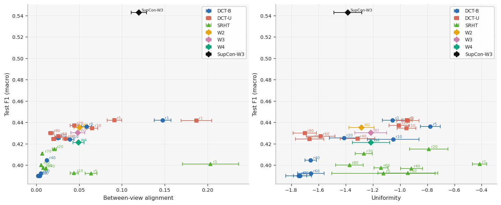

# Compressive-Augmentation for View-Based Learning

## Abstract

We study whether classical compressive sensing methods can provide effective augmentations for learning semantically meaningful music-genre representations. We use the "FMA small" dataset, a collection of 8,000, 30-second clips from songs split evenly across 8 genres. Augmentation is applied directly to waveforms, then converted to mel-spectrogram for encoding and projection onto a Barlow Twins objective. Compressive style augmentation beats and is competitive with traditional augmentation on downstream linear F1-macro as well as exhibits stronger between-view alignment. Furthermore we show against a supervised reference manifold that higher magnitude nuisance perturbation corresponds to higher F1-macro scores.

## Repository

This repository defines the training, analysis, and visualization that defines the experiments outlined in my ENGS109 (Compressive-Sensing) project. Instructions below define how to use the repository in a general sense, but the SLURM scripts under `scripts/` assume you have access to Dartmouth College's Discovery cluster (specifically their H200s).

## Results

Test F1-macro confidence intervals by method and ratio.

| Family | Method | Ratio | Test F1-macro (95% CI) |
| --- | --- | ---: | --- |
| Reference | SupCon-W3 | -- | 0.543 [0.536, 0.550] |
| Baseline | Mel PCA-256 | -- | 0.369 [0.369, 0.369] |
| Traditional | W2 | -- | 0.435 [0.407, 0.464] |
| Traditional | W3 | -- | 0.430 [0.402, 0.458] |
| Traditional | W4 | -- | 0.421 [0.404, 0.439] |
| DCT-B | r1 | 1 | 0.442 [0.425, 0.459] |
| DCT-B | r5 | 5 | 0.436 [0.417, 0.455] |
| DCT-B | r10 | 10 | 0.424 [0.411, 0.437] |
| DCT-B | r20 | 20 | 0.426 [0.416, 0.435] |
| DCT-B | r40 | 40 | 0.405 [0.384, 0.425] |
| DCT-B | r60 | 60 | 0.392 [0.375, 0.410] |
| DCT-B | r70 | 70 | 0.390 [0.373, 0.407] |
| DCT-B | r80 | 80 | 0.390 [0.371, 0.409] |
| DCT-U | r1 | 1 | 0.442 [0.432, 0.452] |
| DCT-U | r5 | 5 | 0.442 [0.430, 0.454] |
| DCT-U | r10 | 10 | 0.435 [0.419, 0.450] |
| DCT-U | r20 | 20 | 0.437 [0.417, 0.458] |
| DCT-U | r40 | 40 | 0.425 [0.412, 0.437] |
| DCT-U | r60 | 60 | 0.427 [0.408, 0.446] |
| DCT-U | r70 | 70 | 0.425 [0.404, 0.445] |
| DCT-U | r80 | 80 | 0.430 [0.417, 0.443] |
| SRHT | r1 | 1 | 0.401 [0.385, 0.417] |
| SRHT | r5 | 5 | 0.392 [0.375, 0.409] |
| SRHT | r10 | 10 | 0.393 [0.376, 0.409] |
| SRHT | r20 | 20 | 0.415 [0.400, 0.430] |
| SRHT | r40 | 40 | 0.397 [0.383, 0.411] |
| SRHT | r60 | 60 | 0.398 [0.384, 0.411] |
| SRHT | r70 | 70 | 0.411 [0.397, 0.425] |
| SRHT | r80 | 80 | 0.400 [0.386, 0.414] |

Top-5 test F1-macro point estimates.

| Rank | Method | Test F1-macro | Val F1-macro |
| ---: | --- | ---: | ---: |
| 1 | SupCon-W3 | 0.543 | 0.663 |
| 2 | DCT-B r1 | 0.442 | 0.542 |
| 3 | DCT-U r5 | 0.442 | 0.552 |
| 4 | DCT-U r1 | 0.442 | 0.554 |
| 5 | DCT-U r20 | 0.437 | 0.553 |
| -- | Mel PCA-256 | 0.369 | 0.511 |

## Figures

Test F1-Macro 95% Confidence Intervals versus Measurement Ratio m/N



Nuisance Perturbation versus Test F1-macro and Between-View Alignment. SRHT at m/N = 1%
is an outlier, hence x-axis is log-scale.



Alignment and Uniformity against Test F1-macro. Points are labeled by ratio and denoted with
random seed uncertainty for each x-axis value



## Repository Structure

```
src/
  csmath/       # domain-agnostic CS operators and losses (DCT, SRHT, Barlow, SupCon)
  common/       # abstract base classes and shared utilities (BaseBarlowDataset, set_seed)
  audio/        # FMA audio encoder, dataset classes, augmentation policies, preprocessing
    preprocess/ # decode_audio, manifests, mel tensor generation
  rf/           # stub; RF/AMC domain code lives here in future branches
scripts/
  ingest_fma.sh       # download + decode + manifest + optional mel for FMA Small
  ingest_rml2016.sh   # stub with manual download instructions for RML2016.10a
  run_train.sbatch    # SLURM job: full training sweep across two H200s
  run_analyze.sbatch  # SLURM job: embedding analysis on one H200
tests/
  csmath/   # DCT round-trip, energy conservation, WHT involutory, SRHT NaN sweep, loss invariants
  audio/    # encoder shape, NaN, CPU/CUDA parity, gradient flow
train.py    # training entry point
analyze.py  # post-training analysis entry point
plot.py     # figure generation entry point
```

## Usage

### Setup

```bash
python -m venv .venv
source .venv/bin/activate
pip install -r requirements.txt
pip install -e .
```

Requires `ffmpeg` on `PATH`.

### Data

Download and preprocess FMA Small with the ingest script:

```bash
bash scripts/ingest_fma.sh data/
```

This downloads FMA Small audio and metadata (~8 GB), decodes mp3s to `.npy`, and writes split manifests to `data/fma_small_mel/`. Pass `--mel` to also generate mel-spectrogram tensors (required only for the mel-PCA analysis baseline).

Data layout after ingest:

```text
data/
  fma_small/          # mp3s + decoded .npy files
  fma_metadata/       # tracks.csv
  fma_small_mel/      # manifest_*.csv (+ *.pt tensors if --mel was passed)
```

### Tests

```bash
.venv/bin/python -m pytest tests/ -v
```

Tests run on both CPU and CUDA (CUDA skipped automatically if unavailable).

### Train

```bash
python train.py --half 0 --scratch-dir . \
  --data-dir data/fma_small_mel \
  --audio-root data

python train.py --half 1 --scratch-dir . \
  --data-dir data/fma_small_mel \
  --audio-root data
```

On SLURM (Discovery cluster):

```bash
sbatch scripts/run_train.sbatch
```

To run only selected families:

```bash
python train.py --half 0 --scratch-dir . --kinds cs_biased cs_uniform cs_srht
```

### Analyze

```bash
python analyze.py \
  --parquet data/wave_barlow_fma_small.parquet \
  --output-dir analysis \
  --checkpoint-dir checkpoints \
  --audio-root data/fma_small_mel
```

On SLURM:

```bash
sbatch scripts/run_analyze.sbatch
```

### Plot

```bash
python plot.py --analysis-dir analysis --output-dir images
```

## Outputs

- `checkpoints/`: trained model checkpoints
- `data/wave_barlow_fma_small.parquet`: extracted embeddings
- `analysis/`: analysis CSVs
- `images/`: generated figures

## Citation

This dataset was made possible by the work of Defferrard et al. If you use FMA downstream, credit the original dataset authors:

> Michaël Defferrard, Kirell Benzi, Pierre Vandergheynst, Xavier Bresson.
> **"FMA: A Dataset for Music Analysis"**
> *18th International Society for Music Information Retrieval Conference (ISMIR), 2017.*
> [Official FMA GitHub Repository](https://github.com/mdeff/fma)
